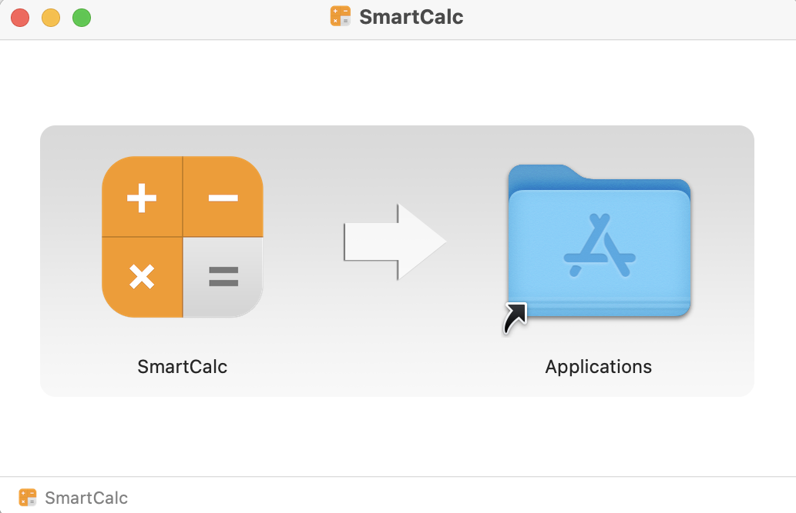

# SmartCalc_Java
In this project an extended version of the common calculator in the Java programming language using the MVP pattern was implemented. The calculator is able to calculate arithmetic expressions and some mathematical functions (sine, cosine, logarithm, etc.). Besides calculating expressions, it also supports the use of the variable _x_ and the graphing of the corresponding function.

## Implementation information
Implementation includes:
- The program is developed in Java 21 language;
- The "core" of the calculator in the form of an algorithm for the formation and calculation of the Polish notation and various computational functions connect as a dynamic library in C++ from the SmartCalc (https://github.com/nikolaymusatov/SmartCalc) project.
- Full coverage of expression calculation modules with unit-tests using the JUnit library was prepared;
- The program is built with Maven and provide an ability to compile application installer.
- GUI implementation, based on JavaFX library:
- The program was implemented using the MVP pattern, which means:
   - there is no business logic code in the view code;
   - there is no interface code in the presenter and the model;
- The program stores the history of operations, allow loading expressions from the history, and clear the entire history;
- The history is saved between runs of the application.
- Both integers and real numbers with a dot can be input into the program. The input of numbers in exponential notation is also supported;
- Calculating arbitrary bracketed arithmetic expressions in infix notation;
- Calculate arbitrary bracketed arithmetic expressions in infix notation with substitution of the value of the variable _x_ as a number;
- Plotting a graph of a function given by an expression in infix notation with the variable _x_ (with coordinate axes, mark of the used scale and an adaptive grid);
- Bracketed arithmetic expressions in infix notation support the following arithmetic operations and mathematical functions:
   - **Arithmetic operators**:
     | Operator name | Infix notation   (Classic) |
      | --------- | ------ |
      | Brackets | (a + b) |
      | Addition | a + b |
      | Subtraction | a - b |
      | Multiplication | a * b |
      | Division | a / b |
      | Power | a ^ b |
      | Modulus | a mod b |
      | Unary plus | +a |
      | Unary minus | -a |

      >Please note that the multiplication operator contains a mandatory `*` sign.  
   - **Functions**:
      | Function description | Function |
      | ------ | ------ |
      | Computes cosine | cos(x) |
      | Computes sine | sin(x) |
      | Computes tangent | tan(x) |
      | Computes arc cosine | acos(x) |
      | Computes arc sine | asin(x) |
      | Computes arc tangent | atan(x) |
      | Computes square root | sqrt(x) |
      | Computes natural logarithm | ln(x) |
      | Computes common logarithm | log(x) |

## Building and installation
The application is built using maven.  
Building an application consists of two stages:
1. Building an executable jar file with all dependencies. To do this, you need to run the `mvn package` command in the project directory. After this, the "target" directory will appear in which all the compiled classes, the dynamic C++ model library and the executable jar file "SmartCalc.jar" will be located.
2. Assembling the installer (application image). To build the installer, Jpackage is used, which is called using exec-maven-plugin. By default, Jpackage is configured to build a dmg-file to work with MacOS. To build the installer for other operating systems, you must independently change the type of the final output file in the jpackage configuration described in pom.xml in the exec-maven-plugin section. To build the installer, you need to run the command `mvn exec:exec@compile-installer`. After that, the "installer" folder will appear in the "target" folder, which will contain the final installer file.  
After this, you need to run the installer file and drag the SmartCalc icon into the Applications folder  

    

## Usage
To calculate the value of an expression, you need to write the
expression itself in the text field labeled “expression” and click
the equal button. The result will be displayed in the same text field.  

    

To plot a function graph, you need to write the function in the text field
labeled “expression” and click the plot button. This will open a window
in which a graph of the function will be plotted, and controls will also
be displayed. With their help, you can select the range of values ​​​​and
the domain of definition displayed on the graph.  

    

The calculator supports calculating the value of an expression
depending on the variable X. To do this, enter the expression in the
text field labeled “expression” and click the plot button. Then in the
"Enter X value" field you must enter the value of the variable.
The result will be shown in the "F(X) value" field.

To view the calculation history, click the "List" button. You can select an expression from the list displayed by clicking on it.  

    

